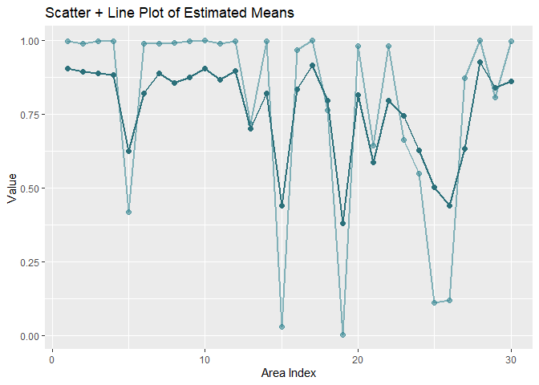

<!-- README.md is generated from README.Rmd. Please edit that file -->

# saeHB.TF.beta

<!-- badges: start -->
<!-- badges: end -->

`saeHB.TF.beta` provides several functions for area and subarea level of
small area estimation under Twofold Subarea Level Model using
hierarchical Bayesian (HB) method with Beta distribution for variables
of interest. Some dataset simulated by a data generation are also
provided. The ‘rstan’ package is employed to obtain parameter estimates
using STAN.

## Function

## Installation

You can install the development version of saeHB.TF.beta from
[GitHub](https://github.com/) with:

``` r
# install.packages("devtools")
devtools::install.github("Nasyazahira/saeHB.TF.beta")
```

## Example

Here is a basic example of using the **betaTF** function to make
estimates based on sample data in this package

### Load Package and Data

``` r
library(saeHB.TF.beta)

#Load Dataset
data(dataBeta) #for dataset with nonsampled subarea use dataBetaNS
```

### Exploration

``` r
dataBeta$CV <- sqrt(dataBeta$vardir)/dataBeta$y
explore(y~X1+X2, CV = "CV", data = dataBeta, normality = TRUE)
#>                   y         X1         X2
#> Min.    0.002826007 0.04205953 0.02461368
#> 1st Qu. 0.677417203 0.34818477 0.20900053
#> Median  0.986658040 0.58338771 0.39409355
#> Mean    0.786269096 0.57240016 0.43864087
#> 3rd Qu. 0.999116512 0.85933934 0.73765722
#> Max.    1.000000000 0.99426978 0.96302423
#> NA      0.000000000 0.00000000 0.00000000
#> 
#> Normality test for y :
#> Decision: Data do NOT follow normal distribution, with p.value = 0 < 0.05
```


### Modelling

``` r
#Fitting model
fit <- betaTF(y~X1+X2, area="codearea", weight="w", data=dataBeta, iter.update = 5, iter.mcmc = 10000)
```

### Extract Result for Area

Area mean estimation

``` r
fit$Est_area
```

Area random effect

``` r
fit$area_randeff
```

Calculate Area Relative Standard Error (RSE) or CV

``` r
RSE_area <- (fit$Est_area$SD)/(fit$Est_area$Mean)*100
summary(RSE_area)
```

### Extract Result for Subarea

Subarea mean estimation

``` r
fit$Est_sub
```

Subarea random effect

``` r
fit$sub_randeff
```

Calculate Subarea Relative Standard Error (RSE) or CV

``` r
RSE_sub <- (fit$Est_sub$SD)/(fit$Est_sub$Mean)*100
summary(RSE_sub)
```

### Extract Coefficient Estimation $\beta$

``` r
fit$coefficient
```

### Extract Area Random Effect Variance $\sigma_u^2$ and Subarea Random Effect Variance $\sigma_v^2$

``` r
fit$refVar
```

### Visualize the Result

``` r
library(ggplot2)
```

Save the output of Subarea estimation and the Direct Estimation (y)

``` r
df <- data.frame(
  area = seq_along(fit$Est_sub$Mean),             
  direct = dataBeta$y,              
  mean_estimate = fit$Est_sub$Mean
)
```

Area Mean Estimation

``` r
ggplot(df, aes(x = area)) +
  geom_point(aes(y = direct), size = 2, colour = "#388894", alpha = 0.6) +   # scatter points
  geom_point(aes(y = mean_estimate), size = 2, colour = "#2b707a") +   # scatter points
  geom_line(aes(y = direct), linewidth = 1, colour = "#388894", alpha = 0.6) +  # line connecting points
  geom_line(aes(y = mean_estimate), linewidth = 1, colour = "#2b707a") +  # line connecting points
  labs(
    title = "Scatter + Line Plot of Estimated Means",
    x = "Area Index",
    y = "Value"
  )
```



``` r
ggplot(df, aes(x = , direct, y = mean_estimate)) +
  geom_point( size = 2, colour = "#2b707a") +
   geom_abline(intercept = 0, slope = 1, color = "gray40", linetype = "dashed") +
  geom_smooth(method = "lm", color = "#2b707a", se = FALSE) +
  ylim(0, 1) +
  labs(
    title = "Scatter Plot of Direct vs Model-Based",
    x = "Direct",
    y = "Model Based"
  )
```


Combine the CV of direct estimation and CV from output

``` r
df_cv <- data.frame(
  direct = sqrt(dataBeta$vardir)/dataBeta$y*100,              
  cv_estimate = RSE_sub
)
df_cv <- df_cv[order(df_cv$direct), ]
df_cv$area <- seq_along(dataBeta$y)
```

Relative Standard Error of Subarea Mean Estimation

``` r
ggplot(df_cv, aes(x = area)) +
  geom_point(aes(y = direct), size = 2, colour = "#388894", alpha = 0.5) +
  geom_point(aes(y = cv_estimate), size = 2, colour = "#2b707a") +
  ylim(0, 100) +
  labs(
    title = "Scatter Plot of Direct vs Model-Based CV",
    x = "Area",
    y = "CV (%)"
  )
```


